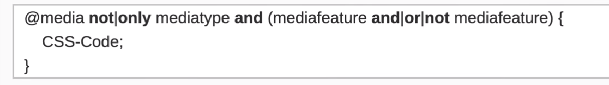

### Viewport :::

Viewport là một khái niệm quan trọng trong CSS, đặc biệt trong thiết kế trang web đáp ứng (responsive web design). Viewport đề cập đến phần của trang web mà người dùng có thể thấy trên màn hình của họ. Trong CSS, bạn sử dụng các thuộc tính và meta tags để điều chỉnh cách trình duyệt hiển thị và điều hướng trang web trên các thiết bị khác nhau. Dưới đây là một số cách viewport được sử dụng:

Meta Tag Viewport: Trong HTML, bạn có thể sử dụng meta tag viewport để xác định cách trình duyệt diễn dịch và hiển thị trang web. Ví dụ:
<meta name="viewport" content="width=device-width, initial-scale=1.0">
Trong ví dụ này, width=device-width đặt kích thước viewport theo kích thước của thiết bị, và initial-scale=1.0 đặt tỷ lệ phóng to ban đầu là 1.

--------------------------------------------------------
### các thuộc tính trong viewport :::

*** width *** : Thuộc tính width xác định chiều rộng của viewport. Bạn có thể đặt giá trị cụ thể bằng pixel (px) hoặc dùng các đơn vị khác, hoặc sử dụng giá trị đặc biệt như device-width để làm cho chiều rộng phù hợp với kích thước thiết bị.

*** height *** : Thuộc tính height xác định chiều cao của viewport. Tương tự như width, bạn có thể đặt giá trị cụ thể hoặc sử dụng device-height để thiet lập chiều cao dựa trên thiết bị.

*** initial-scale *** : Thuộc tính initial-scale đặt tỷ lệ phóng to ban đầu của trang web. Giá trị mặc định là 1.0, điều này đại diện cho 100%. Bạn có thể thay đổi giá trị này để kiểm soát mức độ phóng to ban đầu của trang.

*** minimum-scale ***  và *** maximum-scale*** :
Đây là thuộc tính để đặt giới hạn cho việc thu nhỏ hoặc phóng to trang. Bạn có thể đặt minimum-scale để ngăn người dùng thu nhỏ quá mức hoặc maximum-scale để ngăn người dùng phóng to quá mức.

*** user-scalable *** : Thuộc tính user-scalable xác định xem người dùng có được phép thu nhỏ hoặc phóng to trang web không. Giá trị no sẽ vô hiệu hóa khả năng thu nhỏ và phóng to.

initial-scale: Xác định tỷ lệ phóng to ban đầu của trang.

minimum-scale: Xác định tỷ lệ phóng to tối thiểu cho trang.

maximum-scale: Xác định tỷ lệ phóng to tối đa cho trang.

user-scalable: Xác định xem người dùng có thể tự do phóng to hoặc thu nhỏ trang hay không.

